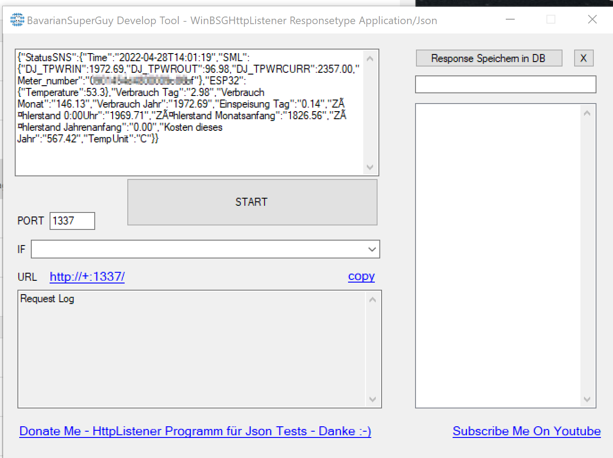
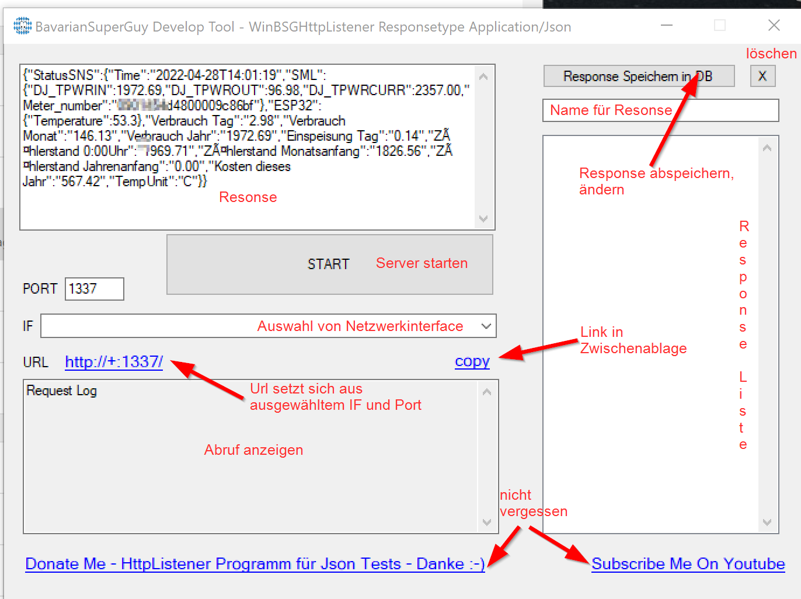
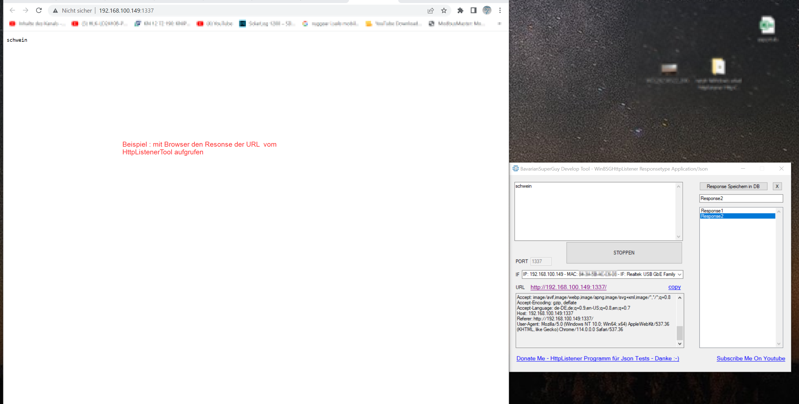
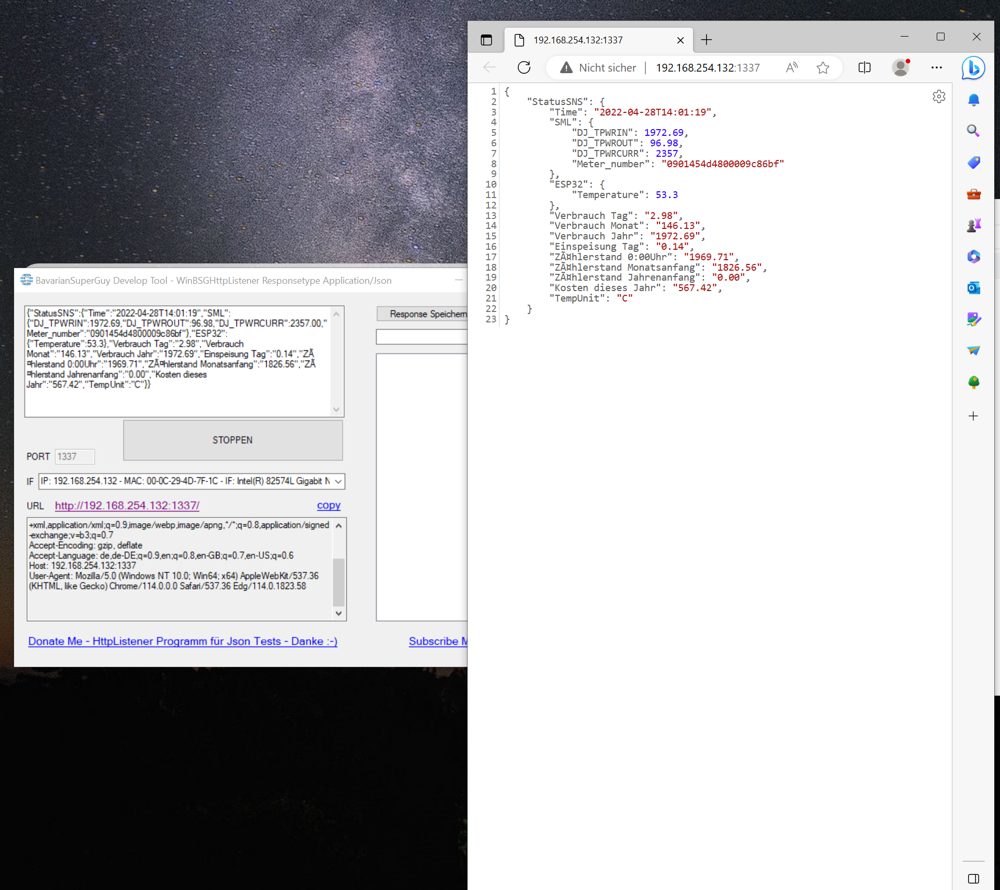

# WinBSG_HttpJsonListener
Ein SIMPLES  Json Server Tool zum testen von Json aufrufen , simulieren von Tasmota ausgaben ...Http Server Json Server  
Response Typ - application/Json

Das Programm startet im Admin Mode und erzeugt eine lokale xml datenbank , namens dsdb  
In dieser werden die Responses abgelegt die ihr speichert  
Das Programm kann kostenfrei genutzt werden  

Falls Ihr mich unterstützen wollt, Spenden zum Projekt und Projekten sind herzlich willkommen und würde mich sehr freuen uhund kommen in jedem Fall gut an :-)  
Projekt Spende Gerne Hier bitte - https://paypal.me/BSGuy  

Was nett wäre, Vergesst bitte nicht meinen Kanal zu abonnieren und zu liken ;-) ... wann disliken gut wär, dann das auch :-))  
https://www.youtube.com/c/BavarianSuperGuy  

  
  
  
UND HIER das HANDBUCH ! Fragen zwecklos! Spenden  erlaubt :-) 
- Interface Auswahl , wann du mehrere Netzwerkkarten hast, das richtige mit deinem IP Bereich auswählen 
- Response Text kann während Laufzeit geändert werden und wird bei aktualisieren des Browserfensters bzw. UrL abfrage auch so ausgegeben
- 2 Beispiele weiter unten  
  
  
  

Anwendungsbeispiele  
  
Beispiel1  

  
  
Beispiel2  

